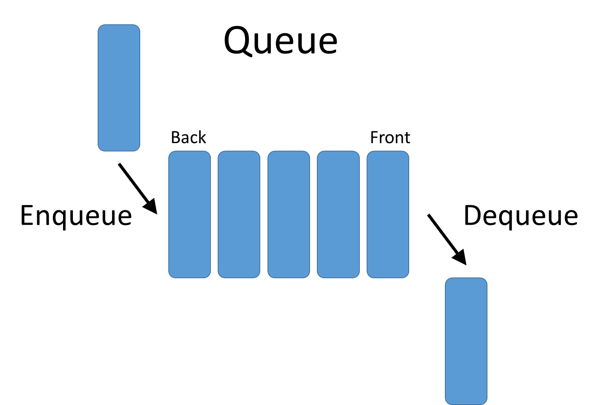
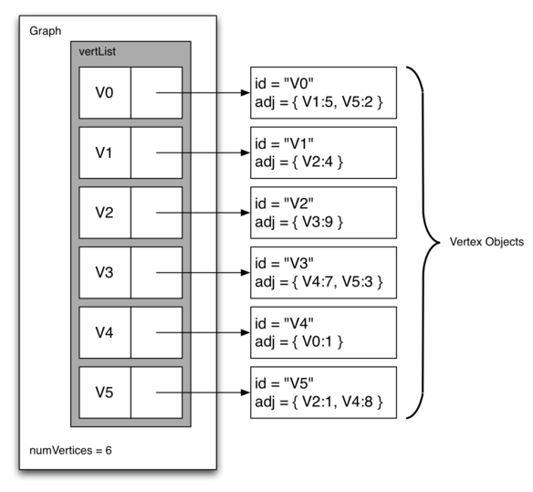

Notes taken from time taking [this course at Bradfield School of Computer Science in SF](https://bradfieldcs.com/courses/algorithms/)
### Technical Problem Solving and Analysis
#### [How to Solve It](https://www.amazon.com/How-Solve-Mathematical-Princeton-Science/dp/069111966X)
* Forward
  * Hardest part of solving a problem => understanding precisely what the problem says
  * if you can’t solve a problem, then there is an easier problem you can’t solve: find it
* Helping the Student
  * Teacher should help, but too much and not too little, so that the student shall have a reasonable share of work
  * **Solving problems like any practical skill** => you obtain it by **imitation** and **practice**
  * Main Divisions, Main Questions
    * Four Phases
      * Trying to find a solution, we may repeatedly change our point of view, our way of looking at a problem
        * Conception of problem incomplete when we start work, changes when we have made progress, again different once we have obtained solution
        * Making plan before execution can save lots of steps
      * **Understand Problem** => see clearly what is required
        * Write down **flow** of situation, actors involved
        * Could you restate problem?
      * See **how the various items** are **connected**, how the unknown is linked to the data => obtain the idea of the solution to make a plan
        * Think / write tests
      * Carry out Plan
        * code
      * Look back at solution and examine
        * **Refactor**

      * If you cannot solve the proposed problem, try to solve first some related problem
  * Class
    * Multiple ways to skin a cat with different **trade offs**
    * **Big O**
      
      * **estimate** of the **cost** in terms of the input for space or time
        * Input size can change which algorithm is best => i.e., dif sorting algorithms for dif situations
      * **Upper bound** => as N gets very large, our function will prob take up more performance than characterization
      * **Amortized** => on **average**
      * Computer **hardware** can **affect** **actual** **performance** of function that differs greatly from big O
      * **Log(n)** => **number** of **digits** in base
    * Steps problem => can take 1 or 2 steps to complete all steps
      * Fibonacci pattern => recognizing problems you already know
  * Further
    * [Hammock Driven Development](https://www.youtube.com/watch?v=f84n5oFoZBc)
      * Least expensive to find bugs in design
        * **Biggest** **problems** in **software** are problems of **misconception** usually
      * **Focus**ing on **same** **problem** for a **long** **period** (**at least 1 hour uninterrupted**) of time
      * Use **Waking Mind** time to **feed** **work** **to background mind**
      * get **away** **from** **computer**
    * [Skiena ADM](https://www.youtube.com/watch?v=ZFjhkohHdAA&list=PLOtl7M3yp-DV69F32zdK7YJcNXpTunF2b)
      * Intro
        * Think of counterexamples to heuristic
          * Small examples
          * Think about ties with your decision criteria
          * Extremes of big and small input
    * Algos/Analysis
      * The Big Picture
        * **Program time and space depends on...**
          * Inputs => grepping over many files takes longer than fewer
          * How long it takes computer to execute every instruction
          * What language you use
          * What other programming are running at the same time
          * How many cores your machine uses
        * **Algorithm analysis** => compare the time and space efficiency of programs with respect to their possible inputs, but **irrespective** **of** **context** (mentioned above)
      * Big O Notation
        * Algorithm’s execution time => **number** of **steps** **required** **to** **solve** the **problem**
          * Independent of any particular program or computer
        * **T(n)** => **time** it **takes** to **solve** a **problem** of **size** **n**
### Data Structures
* Linear data structures => once an item is added, it stays in the same position relative to its neighbors
  * /[algos](https://bradfieldcs.com/algos/)
    * **Data structure** => **implementation** **details** of an **Abstract Data Type** and requires a physical view of the data using some collection of primitive data types and other programming constructs
      * [ADT vs Data Structure](https://abrickshort.wordpress.com/2005/03/06/abstract-data-types-vs-data-structures/)
    * **Stacks** => ordered collection of items where additions of **new** items and the **removal** of existing items **always** take place at the **same** **end**
      
      * Intro
        * Example => every web browser uses stack to keep track of visited URLs when clicking “Back” button
        * The Stack Abstract Data Type => ordered collection of items where items are added to and removed from the top
          * **Abstract** data type => **logical** **description** of how we view the data and the **allowed** **operations** without regards to how they’ll be implemented
            * demonstrates the API of the data type
            * Concerned with what the data represents and not how it’s implemented
            * Information hiding => level of abstraction that encapsulates the data and hides implementation details from the user’s view
        * Balanced Parenthesis
          * Stacks great to use for detecting whether parenthesis balance
          ```ruby
          def balanced_parens?(expression)
              stack = []
              opening_parens = "("
              closing_parens = ")"

              expression.chars.each do |parens|
                if parens == opening_parens
                  stack.push(parens)
                else
                  return false if stack.empty?
                  stack.pop
                end
              end

              stack.empty?
            end
          ```
        * Stacks also great for Converting Number Bases
          * Divide by base and append remainders on top of stack
          * pop remainders off and get index of remainder in digits
    * **Queues** => ordered collection where the **addition** of new items happens at **one end**, the “**rear**”, and the **removal** of existing items happens the **other** **end**, the “**front**”
      
      * **FIFO** => first in, first out
    * **Deques** => like queue but with unrestrictive nature where items can be added to the both the rear and front
      * Useful for checking palindrome because we remove from each end and just check if match
      * enables behavior of **both** a **stack** **and** **queue**
      * pronounced like “deck”
    * **Lists** => **collections** of items where **each** item (**node**) **holds** a **relative** **position** with respect to others
      * **Singly linked** list => each node **only** references **next** node
      
      * **Doubly linked** list => each nodes references **previous** **and** **next** node
      
      * Lists can also be **ordered** **or** **unordered**
    * **Hashing**
      * Lookup in O(1) time (in theory)
        * chaining obviously prevents this
      * **Hash table** => collection of items stored in such a way to make it easy to find them later
        
        * **slot** => each **position** in **hash** **table**
        * **Hash function** => **mapping** between a **key** and the **slot** **where** that **key** **belongs**
          * **Perfect function** would lead to only **1 key per slot** but that would take up an **enormous** of **memory**
          * **Goal** => create hash function that **minimize** **collisions**, is **easy** to **compute**, and **evenly** **distributes** the **items** in the hash table
        * **Load factor** => number of slots occupied
        * **Collisions** => **keys** **map** to **same** **slot**
          * Collision **Resolution**
            * Techniques available for placing collided item in another slot using techniques like
              * Linear probing => look at next slots
              * Quadratic probing => look at slots in series of quadratics
              * Chaining => storing multiple items at same place
        
      * [In Ruby](https://launchschool.com/blog/how-the-hash-works-in-ruby) (oldish, see dox LL idea)
    * Leetcode problems
      * Implement a stack using queues / Implement a queue using stacks
        * can use a second of other to use as temporary storage to maintain a reverse of the other when pushing
    * Class
      * Lists / Arrays
        * **Caching comes into play with lists vs arrays**
          * Lists can have nodes in many places in memory whereas arrays are contiguous blocks
        * Arrays contiguous blocks of memory
          * Size set ahead of time
        * List grows dynamically as desired
      * Ring buffer
        * allows constant insert and removal performance of stacks for queues
      * **Hash tables**
        * Hash **backed** **by** **array** (**contiguous** **block** of **memory**)
        * **Instead** of using just **offset** / **index** ( a number ) **as** the **key**, can **use** any **arbitrary** piece of **data**
        * Hash function finds place for key in bucket
          * Really **common hashing function** for **determining** **bucket** **for** **key** => prime_number * integer % size of array
        * collisions
          * Chaining easier to do but leads to slower look up time and less utilization of array
            * Ruby recently removed chaining
    * Hwk
      * [Code](fast-queue-hash-table)
      * Queue
        * More complicated making LinkedList that is doubly linked
        * Ring buffer growth was tricky
      * **Hashing**
        * Hash function => change key into index (offset for contiguous block of memory) for array
        * Hash tables
          * Backed by arrays
          * Concerned with collisions, when two keys hash to the same values
            * Arrays will need to be resized at some point after a certain amount of collisions
            * **Cryptographic hash functions should not have collisions**
            * **Chaining** => creating linked list at index of collision until a certain size (3-5 nodes) is reached, at which point will re-size
              * Slow to go through
### Divide and Conquer, Sorting and Searching
* The **Binary Search**
  * Requires an ordered / sorted list
  * **O(log(N)) (base 2)** lookup  where N is the number of items
* Class
  * **Recursive problem** => **searching through increasing smaller lists**
    * Can be **iterative or recursive**
  * When** to **divide and conquer?**
    * Can I slice it into some **multiplicative factor?**
    * Does it model it self self recursively **like binary search?**
  * Divide and ignore**
    * Find if a number is a perfect square => binary search
  * vide into duplicates
    * raise a base to an exponent (making use of properties of exponent addition / multiplication)
    * & 1 bitwise operation => tell if even
    * Crossover of divide and conquer and dynamic programming
  * Repeatedly Slice => quick sort
  * Combine Atoms => merge sort
  * Stable sorting algo => same elements don’t move during sorting algorithms
* Find Perfect Square using Binary Search
```ruby
# Perfect Square => exists a number N that N times itself equals target
# Use binary search and instead current * current will match target
def perfect_square?(target)
  high = target / 2
  low  = 1

  while low <= high
    current = (high + low) / 2

    if current * current > target
      high = current - 1
    elsif current * current < target
      low = current + 1
    else # equal
      return true
    end
  end

  false
end

```
### Graph Search
* Pre-Work
  * Trees => data shape that allows us to represent hierarchical relationships
    * Intro
      * Many structures in software are hierarchical, i.e., a file system or an HTML document
      
      
      * Definitions
        * Node => fundamental part of a tree, sometimes referred to as a “key”
          * Payload => additional information in node that is used by applications that make use of tree
        * Edge => another fundamental part of a tree; it connects two nodes to show that there is a relationship between them
          * Every node, other than the root is connected by exactly 1 incoming edge from another edge, its parent, but can have several outgoing edges, children
        * Root => only node in the tree that has no incoming edges
          * In a file system, /
          * In html, the html tag
        * Path => ordered list of nodes connected by edges
        * Children => set of nodes c that have incoming edges from the same node
        * Parent => when a node has a set of outgoing edges to other nodes
        * Siblings => nodes in the tree from the same parent
        * Subtree => set of nodes and edges comprised of a parent and all the descendants of that parent
        * Leaf node => node that has no children
        * Level => for a node N, the number of edges on the path from the root node to N
          * By definition, the level of a root node is 0
        * Height => maximum level of any node in the tree
        
      * Definition one => a tree consists of a **set of nodes** and **edges that connect pairs of nodes**
        * One node of the tree is designated as the root node
        * Every node N, except the root node, is connected by an edge from exactly one other node P, where P is the parent of N
        * A **unique path** traverses from the **root to each node**
        * Binary tree => each node in the tree has a **maximum** of **two children**
        
      * Definition two => a **tree** is either empty or consists of a **root and zero or more subtrees**, each of which is also a tree
        * The root of each subtree is connected to the root of the parent tree by an edge
    * Representing a Tree
      * Nodes and References representation
        * use Node class along with references between node instances
        * Can reference left / right if binary tree, otherwise children can be a list
        
      * List of lists representation
        * not a fan of..
      * Map-based representation using dicts / hashes
    * Parsing a Tree
      * Parse trees => used to represent real-world constructions like sentences or mathematical expressions
        
        * First step to building a parse tree => break up the expression string into a list of tokens
        * Make use of the hierarchical nature of a tree to write an algorithm that recursively evaluates each subtree
          * **Natural base case** => check for a leaf node, a **node** with **no children**
    * Tree Traversals
      
      * Usage patterns for trees divided into the three ways that we access the nodes of a tree
        * Traversal => visitation of the nodes
        * Preorder
          * Visit the root node
          * recursively do a preorder traversal of left subtree
          * followed by recursive traversal of right subtree
          
        * Inorder
          * Recursively do an inorder traversal of left subtree
          * Visit the root node
          * Recursively do an inorder traversal of right subtree
          
        * Postorder
          * Recursively do a postorder traversal of left then right subtree
          * Finally visit root node
          
  * Graphs
    * Intro
      * Graph => more general tree structure
        * Tree is like special kinda of tree structure
      * Vertex => fundamental part of a graph
        * Also known as a node
        * Key => name
        * Payload => additional info
      * Edge => another fundamental part of a graph
        * Connects two vertices to show that there is a relationship between them
        * May be one-way or two-way
        * Directed graph => all edges in graph are 1 way
      * Weight => edges may be weight to show that there is a cost to go from one vertex to another
        * i.e, the distance between 2 cities
      * Graph can be represented as G = (V, E)
        * Each edge is a tuple (v, w) where v, w, is an element of V
          * can add third component to edge tuple which represents weight
            * i.e, (v0, v1, 4)
          * Subgraph => set of edges e and vertices v such that e is a subset of E and v a subset of V
      * Path => sequence of vertices that are connected by edges
      * Cycle => in a directed graph, a path that starts and ends at the same vertex
        * acyclic graph => graph with no cycles
        * directed acyclic graph (DAG) => directed graph (all edges only 1 way) with no cycles
          * Several important problems can be represented as a DAG
      
    * Representing a Graph
      * Many ways to represent a graph, which is useful since you will see them everywhere
      * The Adjacency Matrix => one of the easiest ways to represent a graph by using a two-dimensional matrix
        * Adjacent => when two vertices are connected by an edge
        * Simple, and for small graphs it is easy to represent which nodes are connected to other nodes
        * Useful when the number of edges is large / not sparsely populated
        
      * The Adjacency List
        * Keep a master collection of all the vertices in the Graph object, then each vertex object in the graph maintains a list of the other vertices that it is connected to
        * Allows us to compactly represent a sparse graph
        
    * Implementing Breadth First Search
      * Serves as a prototype for several other important graph algorithms
      * Definition
        * Given a graph G and a starting vertex s, proceeds by exploring edges in the graph to find all the vertices in G for which there is a path from s
        * Finds all the vertices that are **k distance** from s **before** finding any that are **k + 1** => building a tree 1 level at a time
    * A knight’s tour / Depth First Search
      * Represent the legal moves of a knight on a chessboard as a graph
        * Each square on the chessboard can be represented as a node
        * Each legal move can be represented as en edge
      * Use a graph algorithm to find a path where every vertex on the graph is visited exactly once
      * Depth First Search
        * Creates a search tree by exploring one branch of the tree as deeply as possible
        * Finds a dead end and then backs up the tree to the next deepest vertex
      * [Knight’s tour](knights_tour.py) => N^K problem, where K is the average branching factor for the board

    * DFS uses a stack (implicitly with recursive call) whereas BFS uses a queue
  * Class
    * Trees
      * Properties
        * A-cyclic (no cycles reduces complexity)
        * Only parent-child relationship => makes them easier to traverse
      * Examples
        * DOM
        * Filesystem
          * Symlinks technically make it graph like
      * **Tree Implementation**
        * Typical is similar to linked lists
        * Can be represented as an array by knowing branching factor
          * branching_factor * current_index + 1 and branching_factor * current_index + 2
          * Gives better lookup time by just searching for an index
          * Good locality compared to linked lists
      * Lookup generally log(N) time
      * [Minheap / Maxheap](https://www.cs.cmu.edu/~adamchik/15-121/lectures/Binary%20Heaps/heaps.html) (priority queue)
        * minheap => goal to find smallest item in tree in log(N) time
          * Parent always needs to be smaller than parent
        * maxheap => goal to find largest item in tree in log(N) time
      * Binary Search Tree
        * Max 2 children per parent
          * Left is always less, right is always more
        * Ordered data
        * Types of self-balancing binary search trees => AVL and Red Black
        * Traversal => going through whole tree
        * Search => looking for value
        * BFS
          * Frontier => the set of nodes that we know exist but we have not yet explored
         * Queue would never actually do for binary search because doesn’t make use of order of tree / structure
      * Trie
        * “Prefix tree” for retrieval
        * Used for getting contextual data
        * Autocomplete
        * Log26(length of word searching for)
        
      * B-Tree (database index)
        * Average branching factor => 100 children
        * Minimize number of times needed to go to disk visits
        * 2kb stored in node => optimized based on common hardware operations
        * Much better for range queries than hash indexes
        
    * Graphs
      * difficulties
        * Dealing with cycles
          * Explored list
        * Lack of strong hierarchical structure
      * can represent almost every problem that there is
      * State Machine
      * Bfs and dfs
        * worst case both O(N)
        * Really large branching factor favors dfs
        * Algo (start-node)
          * Frontier
          * Explored
          * While frontier..
            * Check if value
            * Put children on frontier
            * Add c to explored
        * [Video overview](https://www.youtube.com/watch?v=bIA8HEEUxZI)
  * HWK
  * Skiena Lectures
    * Graph Data Structures
      * Other Graph / Networks
        * Social Networks
          * Weights could be strength of relationship
        * World Wide Web
          * Vertexs => web pages
          * Edges => links
        * Road Networks
          * Weights => could be time or distance
      * Weights
        * Depending on what you want to do with Graph will mean different weights for different things
      * Sparse vs Dense Graphs
        * sparse
          * ~ N edges => average vertex is of constant degree (number of edges on a vertex)
        * Dense
          * ~ N ^ 2 edges => many edges per vertex
      * Representing Graphs
        * Adjacency Matrix
          * 2 x 2 matrix
          * O(N^2 )
          * Only good for dense graph
        * Adjacency List
          * Array of N vertices where each element points to a list of the edges incident on (connected to) to a given vertex I

### Advanced Graph Search: Uniform Cost Search and A*
* [Dijkstra’s Algorithm](https://www.youtube.com/watch?v=pVfj6mxhdMw) => iterative algorithm used to determine the shortest path (by weight) from one particular starting node to all other nodes in the graph
  * Iterates once for every vertex in the graph; **order controlled by priority queue**
    * priority queue => minheap where items always sorted by value with lowest on top
      * ensures that as we explore one vertex after another we are always exploring the one with the smallest distance
  * Value used to determine the order of the objects in a priority queue is the distance from starting vector
  * **Greedy algorithm** because always mark the shortest vertex
    * **Always make locally optimal choices** with the **hope to make globally optimal choice**
  * Dynamic algorithm because distances updated using previously calculate values
  * Negative Numbers
    * when making assumption that all weights are positive, adding an edge can never make for a shorter path
    * Picking the shortest candidate edge (local optimality) always ends up being correct (global optimality)
    * Frontier of candidate edges does not send right signals => can be led down path with initial low positive weights where expensive weights lurk while an expensive initial weight hides a negative weight
  * [Computerphile](https://www.youtube.com/watch?v=GazC3A4OQTE)
    * Good explanation
    * Dijkstra’s doesn’t have a heuristic for direction, so can lead you down wrong path
  * Ways to tweak algorithm to avoid potential downfalls
  * Time Complexity
    * each vertex can be connected by V-1 vertices, hence the number of adjacent edges E can be V-1
    * finding and updating items in priority queue => log(num vertices in queue)
    * frontier can be up to number of vertices, V
    * Creating dictionary happens in V
    * In total, algorithm should take O(ElogV) to run
      * E => total number of edges
        * Have to potentially look at each edge
      * V => number of vertices
  * A *
    * [Intro](https://www.redblobgames.com/pathfinding/a-star/introduction.html)
      * [Algorithms](https://www.redblobgames.com/pathfinding/a-star/introduction.html#algorithms)
        * **Key idea** for all these algos is that we keep track of an expanding ring of nodes to explore called the **frontier**
        * In general, think of **graph as states and actions that change state**
        * Breadth First Search: explore equally in all directions
        * Dijkstra’s (Uniform Cost Search): prioritize which paths to explore
          * favors paths with low costs
          * i.e., assign lower costs to encourage moving on roads, higher costs to avoid forests, higher costs to discourage going near enemies
        * A* => Modified Dijkstra’s algorithm
          * optimized for a single destination as Dijkstra’s can find paths to all locations
          * Prioritize paths that seem to be leading closer to the goal
      * Early Exit
        * Often we only need to find path from one location to another location, so we can exit early once location (state) is found
      * Movement Costs
        * make use of Dijkstra’s (Uniform Cost Search) when taking cost into account
          * Use priority queue => ensure always pick next to visit by lowest weight
          * Instead of adding a location to the frontier if the location has never been visited, add it if the new path to the location is better than the best previous path
        * Compares how number of steps of starting point compares to distance from start
      * **Heuristic Search**
        * With BDS and Dijkstra’s, frontier expands in all directions => reasonable if trying to find a path to all locations or to many locations
        * Alternative idea is to have **frontier expand towards the goal more than in other directions**
          * Greedy Breadth First Search
            * Instead of using actual distance to the goal like with Dijkstra’s, use estimated distance to the goal for the priority queue ordering
            * Can use a simple heuristic of the difference in dimensions from goal and next to assign priority
            * Doesn’t work well with complex maps
      * A* algorithm
        * Uses **both actual distance to the start like Dijkstra’s as well as estimated distance to the goal**, like Greed BSF
    * [Computerphile](https://www.youtube.com/watch?v=ySN5Wnu88nE)
      * Small extension to dijkstra’s that says we’re getting a bit closer using a heuristic
        * Prioritize nodes that are going roughly in the right direction
      * In the case of a road network, reasonable heuristic is the euclidian distance
### Constraint Satisfaction Problems
* Ch 5 of Artificial Intelligence: A Modern Approach - Constraint Satisfaction Problems
  * Intro
    * See how treating states as more than just little black boxes leads to the invention of a range of powerful new search methods
  * 5.1 - CSP
    * Defined by a set of variables and constraints
    * Each variable has a non-empty empty domain of possible values
    * Couple examples and jargon
  * 5.2 - Backtracking Search for CSP
    * Backtracking search => used for depth-first search that chooses values for one variable at a time and backtracks when a variable has no legal values left to assign
      * Variable and value ordering
        * Minimum remaining values heuristic => choose the variable with the fewest legal moves
          * “Fail-first” variable because it picks a variable that is most likely to cause a failure soon, thereby pruning the search tree
          * Avoids pointless searches through other variables that will eventually fail when most constrained variable is selected
        * Degree heuristic => attempts to reduce the branching factor on future choices by selecting the variable that is involved in the largest number of constraints on other unassigned variables; useful as tiebreaker
        * Least-constraining value heuristic => prefers the value that rules out the fewest choices for the neighboring variables in the constraint graph
          * Helps to decide on the order in which to examine its values
          * Trying to leave maximum flexibility for subsequent variable assignments
* Class
  * **Backtracking General Approach**
    1. Define Base Case
    2. Iterate through all possible states
    3. Explore some path if valid path
    4. Return positive If path leads to solved result
    5. Else backtrack
    6. Return negative results if no state works out
* [Recursion](https://introcs.cs.princeton.edu/java/23recursion/)
  * two main components for every recursive function
    * Base case => returns a value without making any subsequent recursive calls
    * Reduction step => central part of recursive function
      * Relates the value of the function at one (or more) input values to the value of the function at one (or more) other input values
      * Sequence of input values converges to base case
* Problems
  * [N-Queens](https://www.youtube.com/watch?v=xouin83ebxE)

### [Dynamic Programming](https://www.youtube.com/watch?v=OQ5jsbhAv_M&feature=youtu.be)
* /algos/recursion
  * Intro
    * recursion => Method of solving problems that involves breaking a problem down into smaller and smaller subproblems until you have a small enough problem that can be solved trivially
  * The 3 Laws of Recursion
    * Must have a base case
    * Must change its state and move towards a base case
    * Must call itself recursively
  * Dynamic Programming => powerful technique for solving problems in a more efficient way than recursion
    * with **overlapping subproblems**, a recursive strategy may lead to redundant computation
    * Bottom up approach vs recursive’s top down approach
* [Video overview of fib](https://www.youtube.com/watch?v=vYquumk4nWw)
  * dynamic programming better to avoid exceeding call stack limit and speed
* Class
  * [*knapsack* problem](https://www.youtube.com/watch?v=xOlhR_2QCXY&t=0s&list=PLBZBJbE_rGRU5PrgZ9NBHJwcaZsNpf8yD&index=2)
    * brute force has a branching factor of 2 so time complexity would be 2^n
    * Usual steps for Dynamic Programming
    * Recursive Solution
    ```python
    def knapsack(items, cur_item_number, capacity):
        """
        items: dict of item mapped to corresponding weight / value, i.e, items[1][weight] = 5
        cur_item_number: starting from heaviest item, the index of the current item we're considering
        capacity: max weight of bag
        """
        # Base Case
        if num_items == 0 or capacity == 0:
            result = 0 # No items or no space left
        elif if items[cur_item_number][weight] > C:
          # skip current item
            result = knapsack(items, cur_item_number - 1, capacity)
        else:
          skip_current_result = knapsack(items, cur_item_number - 1, capacity)
          take_current_item_result = items[cur_item_number][value] + knapsack(items, cur_item_number - 1, capacity - items[cur_item_number][weight]
          result = max(skip_current_result, take_current_item_result)
        return result
    ```
    * Memoize intermediate results
    ```python
    # store results of cur_item_number and it's effect on capacity at level of tree
    results = {}
    def knapsack(items, cur_item_number, capacity):
        """
        items: dict of item mapped to corresponding weight / value, i.e, items[1][weight] = 5
        cur_item_number: starting from heavest item, the index of the current item we're considering
        capacity: current weight left for bag
        """
        if results[cur_item_number][capacity]:
            return results[cur_item_number][capacity]
        # Base Case
        if num_items == 0 or capacity == 0:
            result = 0 # No items or no space left
        elif if items[cur_item_number][weight] > C:
          # skip current item
            result = knapsack(items, cur_item_number - 1, capacity)
        else:
          skip_current_result = knapsack(items, cur_item_number - 1, capacity)
          take_current_item_result = items[cur_item_number][value] + knapsack(items, cur_item_number - 1, capacity - items[cur_item_number][weight]
          result = max(skip_current_result, take_current_item_result)
        results[cur_item_number][capacity] = result
        return result
    ```
  [Knapsack II](https://www.youtube.com/watch?v=8LusJS5-AGo)
  * edit distance problem
  * on finding the optimal solution..
    * sliding mirror
    * process of finding the optimal cumulative value at each step and comparing past cumulative to current potential value

### Additional
* [Visualizations](https://www.cs.usfca.edu/~galles/visualization/Algorithms.html)
